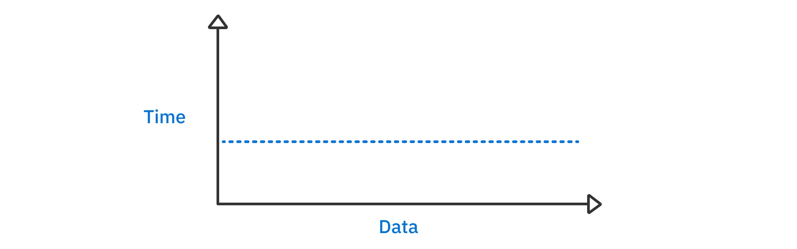
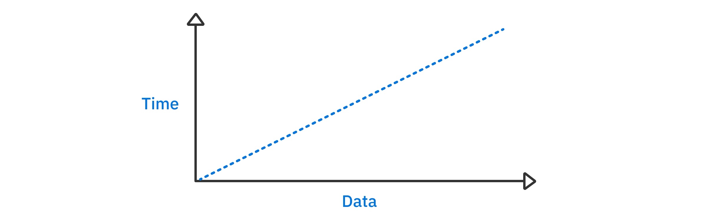
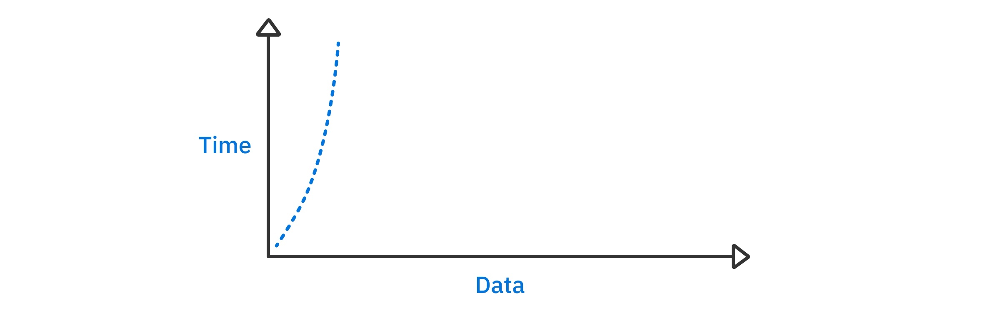
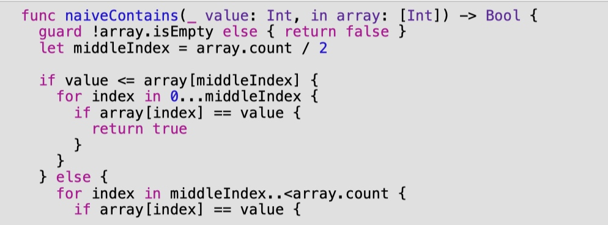
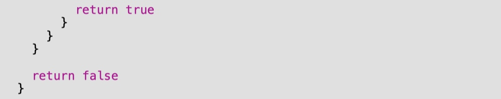
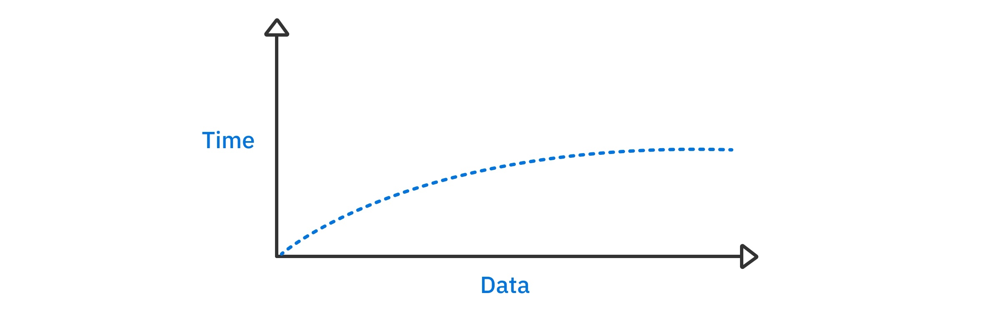
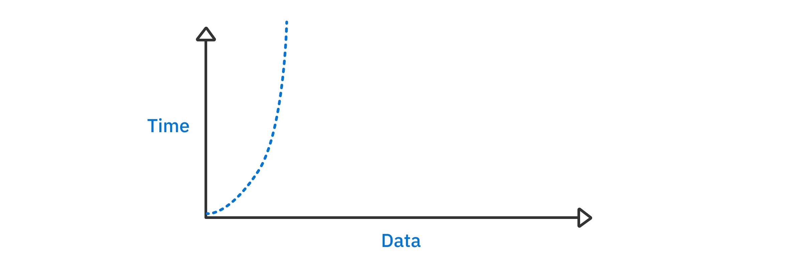
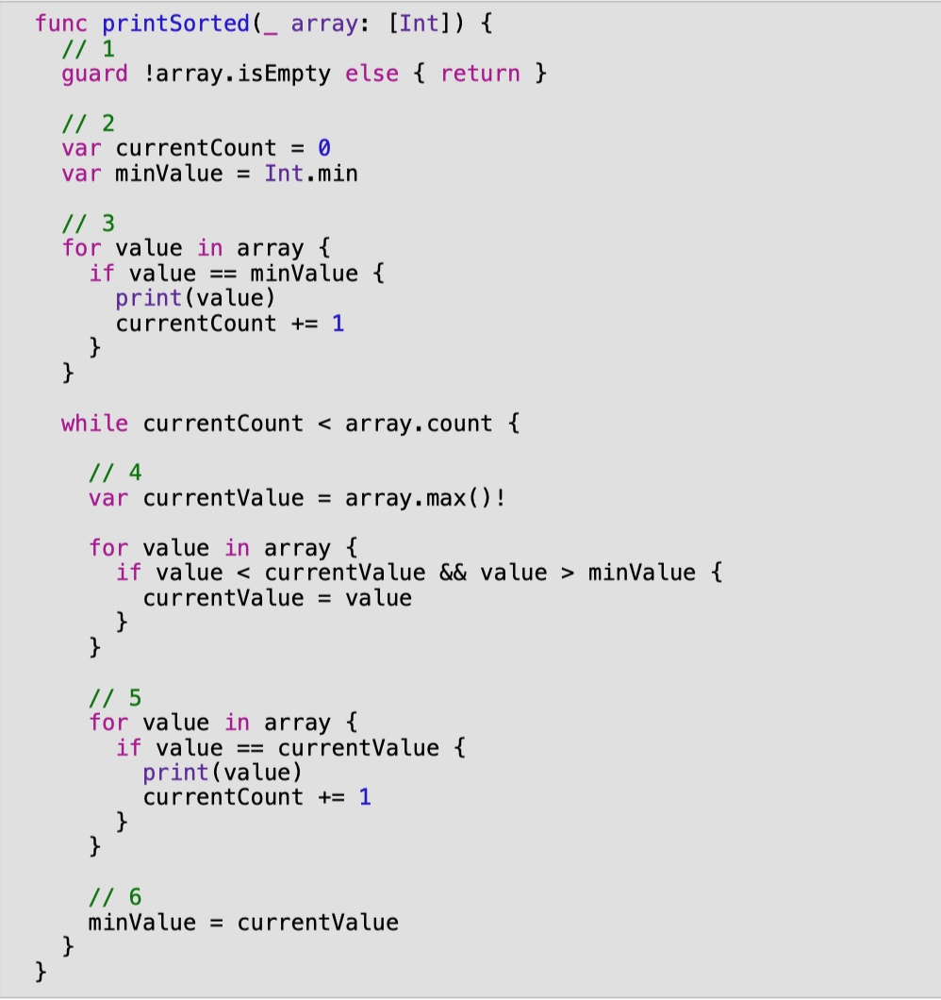

# 第2章：复杂度

# 它能扩展吗？

这个古老的问题总是在软件开发的设计阶段被问及，并且有几种不同的形式。从架构的角度来看，可扩展性是指对你的应用程序进行修改有多容易。从数据库的角度来看，可扩展性是指在数据库中保存或检索数据所需的时间。

对于算法来说，可扩展性是指随着输入规模的增加，算法在执行时间和内存使用方面的表现。

当你在处理少量数据时，一个昂贵的算法可能仍然感觉很快。然而，随着数据量的增加，一个昂贵的算法就会变得残缺不全。那么，它能变得多糟糕呢？了解如何量化这一点是你需要知道的一项重要技能。

在这一章中，你将会看到大O符号在两个维度上的不同可扩展性水平--执行时间和内存使用。

# 时间复杂性

对于少量的数据，由于现代硬件的速度，即使是最昂贵的算法也会显得很快。然而，随着数据的增加，昂贵算法的成本变得越来越明显。时间复杂度是指随着输入大小的增加，运行一个算法所需的时间的量度。在本节中，你将了解最常见的时间复杂度，并学习如何识别它们。

# 恒定时间

恒定时间算法是指无论输入的大小如何，都有相同的运行时间。请考虑以下情况。

```swift
func checkFirst(names: [String]) { 
  if let first = names.first { 
    print(first) 
  } else { 
    print("no names") 
  } 
}
```

名称数组的大小对该函数的运行时间没有影响。无论输入有10个项目还是1000万个项目，这个函数都只检查数组的第一个元素。下面是时间与数据大小的关系图，可以看出这个时间的复杂性。

<div align="center">

</div>

随着输入数据的增加，该算法所需的时间并没有改变。

为了简洁起见，程序员使用一种被称为Big O的符号来表示时间复杂度的各种大小。恒定时间的大O记法是O(1)。

# 线性时间

考虑一下下面的代码片段。

```swift
func printNames(names: [String]) { 
  for name in names { 
    print(name) 
  } 
}
```

这个函数打印出一个字符串数组中的所有名字。随着输入数组大小的增加，for循环的迭代次数也以相同的数量增加。

这种行为被称为线性时间复杂性。


线性时间复杂性通常是最容易理解的。随着数据量的增加，运行时间也以同样的数量增加。这就是为什么你有上面说明的直线图。线性时间的大O符号是O(n)。

> 那么，一个在所有数据上有两个循环并调用六个O(1)方法的函数呢？它是O(2n + 6)吗？
>
>时间复杂度只给出了性能的高层次形态，所以发生了固定次数的循环并不是计算的一部分。在最后的大O符号中，所有的常数都被放弃了。换句话说，O(2n + 6)令人惊讶地等于O(n)。
>
>虽然不是本书的核心关注点，但对绝对效率的优化也很重要。公司投入了数百万美元的研发资金来减少大O符号所忽略的那些常数的斜率。例如，一个算法的GPU优化版本可能比天真的CPU版本快100倍，但仍然是O(n)。虽然我们会忽略这种优化，但像这样的提速是很重要的。

# 二次方时间

通常被称为n的平方，这种时间复杂度指的是一种算法，它所花费的时间与输入大小的平方成正比。考虑一下下面的代码。

```swift
func printNames(names: [String]) { 
  for _ in names { 
    for name in names { 
      print(name) 
    } 
 } 
}
```

这一次，该函数为数组中的每个名字打印出所有的名字。如果你有一个有十个数据的数组，它将打印十个名字的完整列表十次。这就是100条打印语句。

如果你把输入大小增加1，它将打印11个名字的完整列表11次，结果是121条打印语句。与前面的函数不同，它是在线性时间内运行的，随着数据大小的增加，n的平方算法会很快失去控制。

下面是一个说明这种行为的图表。


随着输入数据规模的增加，算法运行的时间也会急剧增加。因此，n次方的算法在规模上的表现并不好。

二次方时间的大O符号是O(n²)。

>无论线性时间的O(n)算法写得多么低效（多次传递等），对于一个足够大的n，线性时间的算法会比超级优化的二次方算法执行得更快。总是如此。每一次都是如此。

# 对数时间

到目前为止，你已经了解了线性和二次方时间的复杂性，其中输入的每个元素至少被检查一次。然而，在有些情况下，只有输入的一个子集需要被检查，从而导致更快的运行时间。

属于这一类时间复杂度的算法是那些可以通过对输入数据的一些假设来利用一些捷径的算法。例如，如果你有一个经过排序的整数数组，那么找到一个特定值是否存在的最快速方法是什么？

一个天真的解决方案是从头到尾检查这个数组，在得出结论之前检查每一个元素。由于你要对每个元素检查一次，这将是一个O(n)的算法。线性时间是相当不错的，但你可以做得更好。由于输入数组是排序的，所以你可以做一个优化。考虑一下下面的代码。

```swift
let numbers = [1, 3, 56, 66, 68, 80, 99, 105, 450]

func naiveContains(_ value: Int, in array: [Int]) -> Bool { 
  for element in array { 
    if element == value { 
      return true 
    }
  }
  return false
}
```

如果你要检查数字451是否存在于数组中，天真的算法将不得不从头到尾进行迭代，对数组中的九个值共进行九次检查。然而，由于数组是被排序的，你可以通过检查中间的值来减少一半的必要比较。
<div align="center">

</div>
<div align="center">

</div>

上述函数做了一个小而有意义的优化，它只检查数组的一半来得出结论。

该算法首先检查中间值，看它与期望值的比较情况。如果中间值比期望值大，算法就不会去看数组右半部分的值；因为数组是排序的，中间值右边的值只能变大。

在另一种情况下，如果中间值小于期望值，算法就不会去看数组的左边。这是一个小而有意义的优化，它将比较的次数减少了一半。

如果你能在整个方法中反复进行这种优化呢？你会在第20章 "二进制搜索 "中找到答案。

一个能够反复放弃一半所需比较的算法将具有对数的时间复杂度。下面是一个描述对数时间算法随着输入数据的增加而表现的图表。

<div align="center">

</div>

随着输入数据的增加，执行算法的时间以缓慢的速度增加。如果你仔细观察，你可能会注意到，该图似乎表现出渐进的行为。这可以通过考虑将你需要做的比较数量减半的影响来解释。

当你的输入大小为100时，将比较次数减半意味着你节省了50次比较。如果输入规模为100,000，减半比较意味着你节省了50,000次比较。你的数据越多，减半的效果就越大。因此，你可以看到，图表似乎接近水平。

这一类的算法很少，但在允许的情况下却非常强大。对数时间复杂性的大O符号是O(log n)。

是对数基数2，对数基数10，还是自然对数？

在上面的例子中，对数基数2适用。然而，由于大O符号只关注性能的形状，实际的基数并不重要。

# 准线性时间

你会遇到的另一个常见的时间复杂性是准线性时间。准线时间算法的性能比线性时间差，但比二次时间要好得多。它们是你要处理的最常见的算法之一。一个准线性时间算法的例子是Swift的排序方法。

准线性时间复杂度的Big-O符号是O(n log n)，这是线性时间和对数时间的乘法。因此，准线性适合于对数时间和线性时间之间；它比线性时间差，但仍比你接下来要看到的许多其他复杂度好。下面是图表。



四次方时间的复杂度与二次方时间的曲线相似，但上升的速度没有那么快，所以对大数据集的适应性更强。

# 其他时间复杂度

到目前为止，你所遇到的五种时间复杂度是你在本书中会遇到的。其他的时间复合体确实存在，但远没有那么常见，它们解决的是更复杂的问题，本书没有讨论。这些时间复合体包括多项式时间、指数式时间、阶乘式时间等等。

需要注意的是，时间复杂度是对性能的高层次概述，它并不判断算法的速度超过一般的排名方案。这意味着两个算法可以有相同的时间复杂度，但其中一个可能仍然比另一个快很多。对于小数据集，时间复杂度可能不是实际速度的准确衡量标准。

例如，如果数据集很小，插入排序等二次方算法可能比合并排序等四次方算法快。这是因为插入排序不需要分配额外的内存来执行算法，而mergesort需要分配多个数组。对于小的数据集，相对于算法需要接触的元素数量，内存分配会很昂贵。

# 比较时间复杂度

假设你写了以下代码，找到了从1到n的数字之和。

```swift
func sumFromOne(upto n: Int) -> Int { 
  var result = 0 
  for i in 1...n { 
    result += i 
  } 
  return result 
}

sumFromOne(upto: 10000)
```

这段代码循环了10000次并返回50005000。它是O(n)，在playground上运行时需要花点时间，因为它在循环中计数并打印出结果。

你可以写另一个版本。

```swift
func sumFromOne(upto n: Int) -> Int { 
  (1...n).reduce(0, +) 
} 

sumFromOne(upto: 10000)
```

在一个playground上，这将运行得更快，因为它调用了标准库中的编译代码。然而，如果你查一下 reduce 的时间复杂度，你会发现它也是 O(n)，因为它调用了 + 方法 n 次。这也是一个大O，但因为是编译过的代码，所以常量较小。

最后，你可以写。

```swift
func sumFromOne(upto n: Int) -> Int { 
  (n + 1) * n / 2 
} 

sumFromOne(upto: 10000)
```
这个版本的函数使用了弗雷德里克-高斯在小学时注意到的一个技巧。也就是说，你可以用简单的算术来计算和。这个最终版本的算法是O(1)，很难被打败。一个恒定时间的算法始终是首选。如果你把这个版本放在一个循环中，你最终仍然是线性时间。之前的O(n)版本离缓慢的二次元时间只差一个外循环。

# 空间复杂度

一个算法的时间复杂度可以帮助预测可扩展性，但它不是唯一的衡量标准。空间复杂度是对算法运行所需资源的一种衡量。对于计算机来说，算法的资源就是内存。考虑一下下面的代码。

```swift
func printSorted(_ array: [Int]) { 
  let sorted = array.sorted() 
  for element in sorted { 
    print(element) 
  } 
}
```

上述函数将创建一个数组的排序副本，并打印该数组。为了计算空间复杂度，你要分析该函数的内存分配情况。

由于array.sorted()将产生一个与数组大小相同的全新数组，printSorted的空间复杂度为O(n)。虽然这个函数简单而优雅，但在某些情况下，你可能希望尽可能少地分配内存。

你可以将上述函数修改为以下内容。
<div align="center">

</div>

这个实现尊重了空间限制。总的目标是多次迭代数组，每次迭代都打印下一个最小的值。下面是这个算法的工作内容。

1. 检查数组是否为空的情况。如果是，就没有什么可打印的。

2. currentCount跟踪所做的打印语句的数量。 minValue存储最后一个打印的值。

3. 该算法首先打印出所有与minValue匹配的值，并根据所做的打印语句的数量更新currentCount。

4. 4.使用while循环，该算法找到大于minValue的最低值，并将其存储在currentValue中。

5. 然后，该算法在更新currentCount的同时打印数组中currentValue的所有值。

6. minValue被设置为currentValue，因此下一次迭代将尝试寻找下一个最小值。

上面的算法只分配了内存来跟踪几个变量，所以空间复杂度是O(1)。这与之前的函数形成对比，后者分配了整个数组来创建源数组的排序表示。

# 其他符号

到目前为止，你已经用大O符号评估了算法。这是迄今为止程序员最常使用的测量方法。然而，也存在其他的记数法。

大欧米茄符号是用来衡量算法的最佳运行时间的。这不像大O那样有用，因为获得最佳情况往往是不成立的。

大Theta符号用于测量一个算法的运行时间，该算法具有相同的最佳和最差情况。

# playground基于线的执行错误

本书广泛地使用了playground。在某些情况下，您可能会发现Xcode 13错误地禁用了基于行的执行。在这些情况下，只需使用playground窗口底部的执行控制按钮来运行整个playground。

# 关键点

- 时间复杂度是指随着输入大小的增加，对运行一个算法所需时间的衡量。

- 你应该知道恒定时间、对数时间、线性时间、准线性时间和二次时间，并能按成本排序。

- 空间复杂度是对算法运行所需资源的一种衡量。

- 大O符号被用来表示时间和空间复杂性的一般形式。

- 时间和空间复杂度是对可扩展性的高级衡量，它们并不衡量算法本身的实际速度。

- 对于小数据集，时间复杂度通常是不相关的。例如，当n很小的时候，一个准线性算法可能比一个二次方算法要慢。

------
|[上一章](/Blogs/DataStructuresChapter1.html)|[目录](/Blogs/DataStructuresChapter0.html)|[下一章](/Blogs/DataStructuresChapter3.html)|
|:----:|:------:|:-------:|