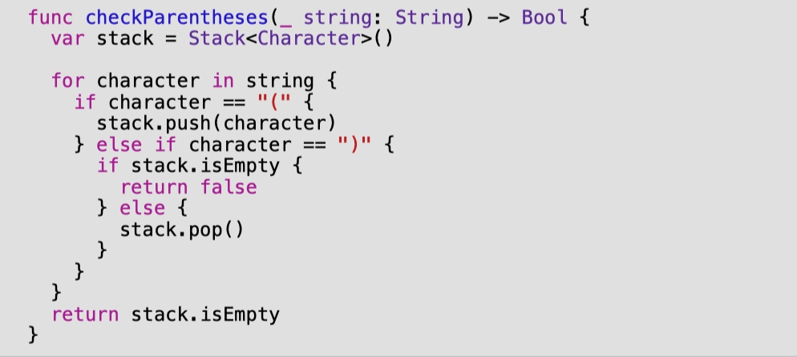

# 第5章：栈进阶
堆栈是一种简单的数据结构，其应用量大得令人吃惊。打开启动器项目开始。在其中，你会发现以下挑战。

# 挑战1: 反转数组 

创建一个函数，使用堆栈以反转顺序打印数组的内容。

# 挑战2：平衡小括号

检查小括号是否平衡。给定一个字符串，检查是否有（和）字符，如果字符串中的小括号是平衡的，则返回真。例如。

```swift
// 1 
h((e))llo(world)() // balanced parentheses

// 2 
(hello world // unbalanced parentheses
```

# 解决方案

# 挑战1的解决方案

堆栈的主要用例之一是方便回溯。如果你把一连串的值推入堆栈，按顺序弹出堆栈，就可以按相反的顺序得到这些值。

```swift
func printInReverse<T>(_ array: [T]) {
  var stack = Stack<T>()
  for value in array { 
    stack.push(value) 
  }
  
  while let value = stack.pop() { 
    print(value) 
  }
}
```

将节点推入堆栈的时间复杂度为O(n)。弹出堆栈以打印数值的时间复杂度也是O(n)。总之，这个算法的时间复杂度是O(n)。

由于你在函数内部分配了一个容器（堆栈），所以你也产生了一个O(n)的空间复杂度成本。

>注意：你应该在生产代码中反转一个数组的方式是调用标准库提供的reversed()方法。对于Array，这个方法在时间和空间上都是O(1)。这是因为它是懒惰的，只创建一个反转到原始集合的视图。如果你遍历这些项目并打印出所有的元素，可以预见的是，它在时间上是O(n)，而在空间上仍然是O(1)。

# 挑战2的解决方案

为了检查字符串中是否有平衡括号，你需要遍历字符串中的每个字符。遇到开口括号，就把它推到一个堆栈里。反之亦然，如果你遇到一个关闭的括号，你应该弹出堆栈。

下面是代码的样子。




这个算法的时间复杂度是O(n)，其中n是字符串中的字符数。由于使用了Stack数据结构，该算法还产生了O(n)的空间复杂度成本。


------
|[上一章](/Blogs/DataStructuresChapter4.html)|[目录](/Blogs/DataStructuresChapter0.html)|[下一章](/Blogs/DataStructuresChapter6.html)|
|:----:|:------:|:-------:|