# 第6章：链表

链接列表是一个以线性、单向顺序排列的数值集合。与Swift Array等连续存储方式相比，链接列表在理论上有一些优势。

- 恒定时间插入和从列表前移出。

- 可靠的性能特征。


如图所示，一个链接列表是一个节点链。节点有两个责任。

1. 持有一个值。

2. 持有对下一个节点的引用。一个nil值代表列表的结束。


在本章中，你将实现一个链表，并学习与之相关的常见操作。你将了解每个操作的时间复杂性，并实现一个整洁的小 Swift 功能，即写时复制。

打开本章的启动器playground，以便你可以直接进入代码。

# 节点

在Sources目录下创建一个新的Swift文件，命名为Node.swift。在该文件中添加以下内容。

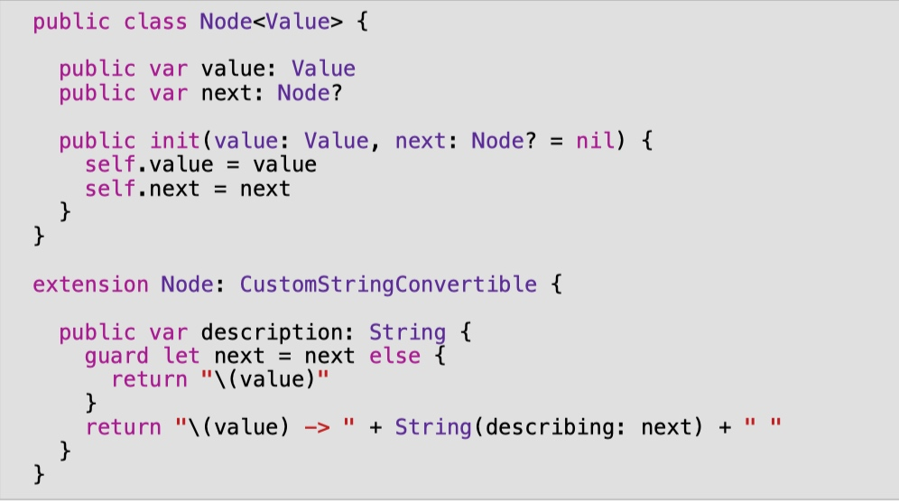

导航到playground页面并添加以下内容。

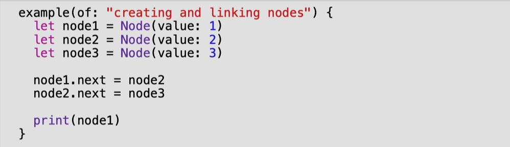

你刚刚创建了三个节点并将它们连接起来。


在控制台，你应该看到以下输出。

    ---创建和连接节点的例子--
    1->2->3

就实用性而言，目前建立列表的方法还有很多需要改进的地方。你可以很容易地看到，用这种方法建立长列表是不切实际的。缓解这个问题的一个常用方法是建立一个管理Node对象的LinkedList。你要做的就是这个

# 链接表

在Sources目录下创建一个新文件，命名为LinkedList.swift。在该文件中添加以下内容。


一个链接列表有一个头和尾的概念，分别指的是列表的第一个和最后一个节点。


# 向列表中添加值

如前所述，你将提供一个接口来管理 Node 对象。你首先要处理好添加值的问题。有三种方法可以向链表添加值，每种方法都有独特的性能特点。

1. 推。在列表的前面添加一个值。

2. 追加。在列表的末尾添加一个值。

3. insert(after:)。在一个特定的列表节点后面添加一个值。

你将在下一节中实现这些操作，并分析它们的性能特点。

# 推送操作

在列表的前面添加一个值被称为推操作。这也被称为 "头先插入"。它的代码简单得令人愉悦。

给LinkedList添加以下方法。

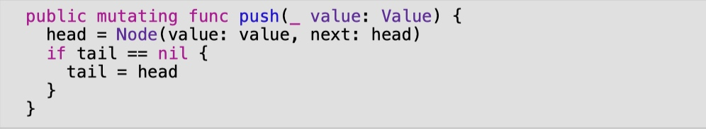

如果你向一个空列表推送，新节点既是列表的头也是列表的尾。

在playground页面中，添加以下内容。

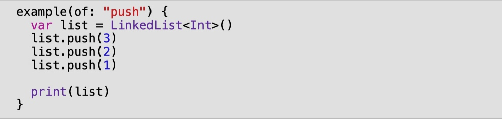

你的控制台输出应该显示如下。

    ---Example of push--
    1 -> 2 -> 3

# 追加操作

你要看的下一个操作是append。这是在列表的最后添加一个值，被称为尾部插入。

在LinkedList.swift中，在push下面添加以下代码。

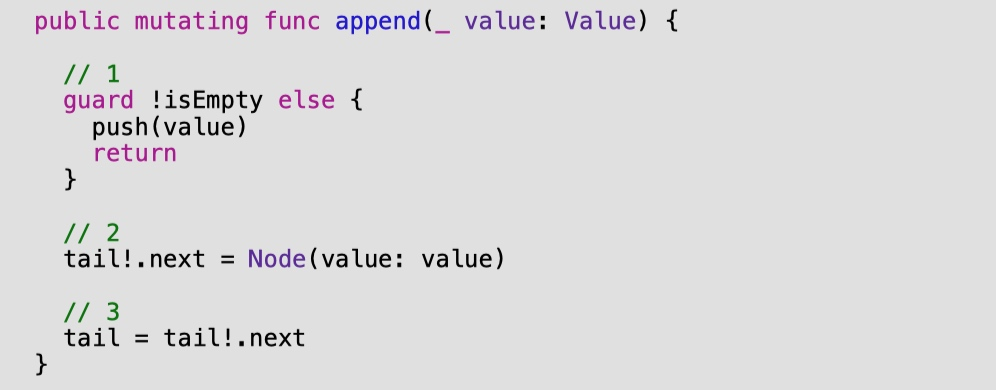

这段代码相对简单。

1. 像以前一样，如果列表是空的，你需要把头和尾都更新为新的节点。因为在空列表上的追加在功能上与推送相同，所以你调用推送来为你做这项工作。

2. 在所有其他情况下，你在尾节点之后创建一个新节点。由于你在 isEmpty 的情况下用上面的 guard 语句推送，强制解包保证成功。

3. 由于这是尾部插入，你的新节点也是列表的尾部。跳回playground，在底部写下以下内容。

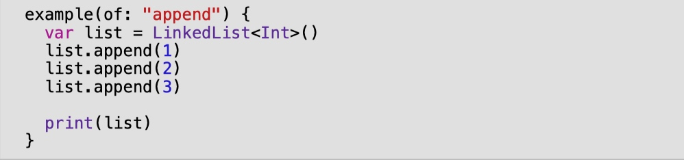

你应该在控制台看到以下输出。

    ---Example of append--
    1 -> 2 -> 3

# insert(after:)操作

第三个也是最后一个添加数值的操作是insert(after:)。这个操作在列表中的一个特定位置插入一个值，需要两个步骤。

1. 找到列表中的一个特定节点。

2. 插入新的节点。

首先，你要实现代码，找到你想插入值的节点。

在LinkedList.swift中，在append下面添加以下代码。

```swift
public func node(at index: Int) -> Node<Value>? { 
  // 1 
  var currentNode = head 
  var currentIndex = 0

  // 2 
  while currentNode != nil && currentIndex < index {
    currentNode = currentNode!.next
    currentIndex += 1 
  }

  return currentNode
}
```

node(at:) 将尝试根据给定的索引检索列表中的一个节点。由于你只能从头部节点访问列表中的节点，你必须进行迭代遍历。下面是具体的操作过程。

1. 你创建一个对头部的新引用，并跟踪当前的遍历次数。

2. 使用一个while循环，将该引用在列表中向下移动，直到达到所需的索引。空的列表或越界的索引将导致返回值为零。

现在你需要插入新的节点。

在node(at:)下面添加以下方法。

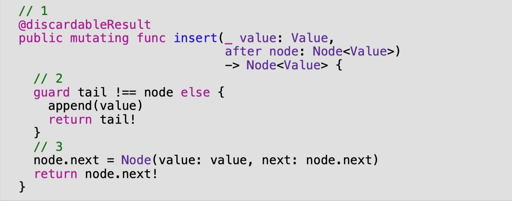

以下是你所做的事情。

1. @discardableResult让调用者忽略这个方法的返回值，而不会让编译器上蹿下跳地警告你。

2. 在这个方法与尾部节点一起被调用的情况下，你将调用功能上等同的append方法。这将照顾到更新尾部。

3. 否则，你只需将新节点与列表的其他部分连接起来，并返回新节点。

跳回playground页面来测试一下。将以下内容添加到playground的底部。

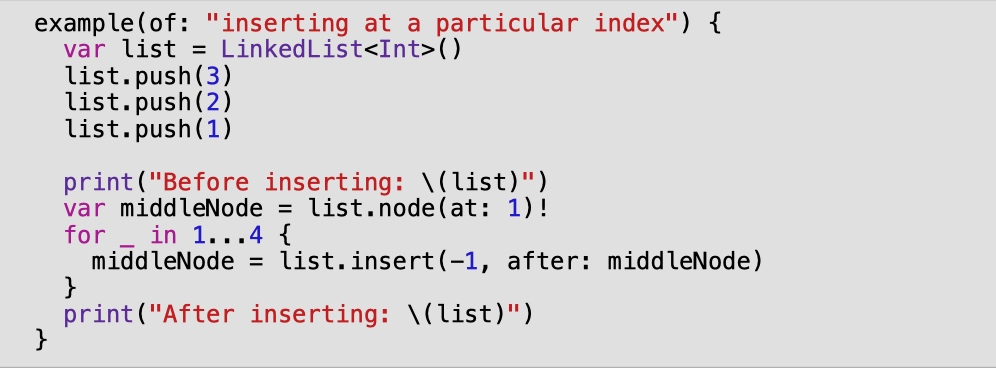

你应该看到以下输出。

    ---Example of inserting at a particular index--
    Before inserting: 1 -> 2 -> 3 
    After inserting: 1 -> 2 -> -1 -> -1 -> -1 -> -1 -> 3
    
# 性能分析

呜呼! 到目前为止，你已经取得了不错的进展。回顾一下，你已经实现了向链表加值的三个操作，以及一个在特定索引处寻找节点的方法。

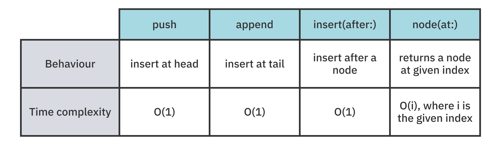

接下来，你将专注于相反的操作：删除操作。

# 从列表中删除数值

有三种主要的删除节点的操作。

1.弹出。删除列表中最前面的值。

2.removeLast：移除列表末尾的值。

3.remove(at:)。移除列表中的任何一个值。

你将实现这三种操作并分析它们的性能特点。

## pop 操作

移除列表前面的一个值通常被称为 pop。这个操作几乎和push一样简单，所以直接进入。

给LinkedList添加以下方法。

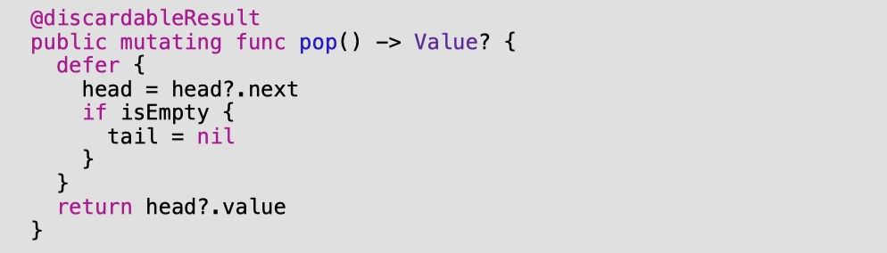

pop 返回从列表中删除的值。这个值是可选的，因为列表可能是空的。

通过将头部向下移动一个节点，你实际上已经删除了列表的第一个节点。一旦方法结束，ARC将从内存中删除旧的节点，因为不会有更多的引用连接到它。如果列表变空了，你就把尾巴设为nil。回到playground页面内，在底部添加以下代码来测试它。

```swift
example(of: "pop") {
  var list = LinkedList<Int>()
  list.push(3) 
  list.push(2) 
  list.push(1)
  
  print("Before popping list: \(list)")
  let poppedValue = list.pop() 
  print("After popping list: \(list)") 
  print("Popped value: " + String(describing: poppedValue))

}
```

你应该看到以下输出。

    ---Example of pop--
    Before popping list: 1 -> 2 -> 3 
    After popping list: 2 -> 3 
    Popped value: Optional(1)
    
# removeLast操作

删除列表中的最后一个节点有些不方便。尽管你有一个对尾部节点的引用，但如果没有对它之前的节点的引用，你就不能砍掉它。因此，你必须做一个艰巨的遍历。在pop下面添加以下代码。

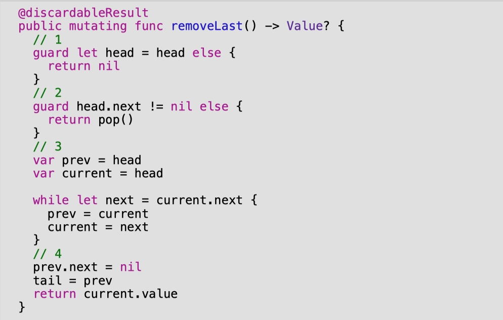

以下是代码中发生的情况。

1. 如果head是nil，就没有什么可以删除的，所以你返回nil。

2. 如果列表只有一个节点，removeLast在功能上等同于pop。由于 pop 将处理更新头部和尾部的引用，你只需将这项工作委托给它。

3. 你继续搜索下一个节点，直到 current.next 为零。这表示当前是列表的最后一个节点。

4. 由于当前是最后一个节点，你只需使用prev.next引用断开它。你也要确保更新尾部的引用。

回到playground页面，在底部添加以下内容。

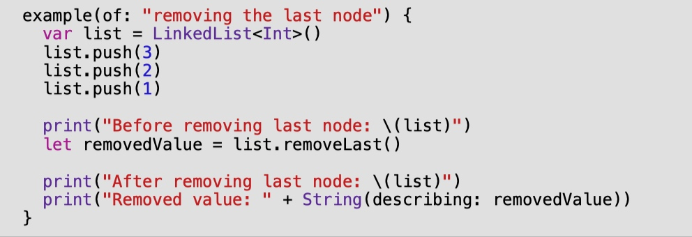

你应该在控制台的底部看到以下内容。

    ---Example of removing the last node--
    Before removing last node: 1 -> 2 -> 3 
    After removing last node: 1 -> 2 
    Removed value: Optional(3)
    
removeLast要求你一路向下遍历列表。这使得一个O(n)操作，相对昂贵。

# remove(after:) 操作

最后的移除操作是在列表中的某一点上移除一个特定的节点。这和insert(after:)的实现很相似；你首先要找到紧挨着你想删除的节点之前的节点，然后解除它的链接。


回到LinkedList.swift，在removeLast下面添加以下方法。

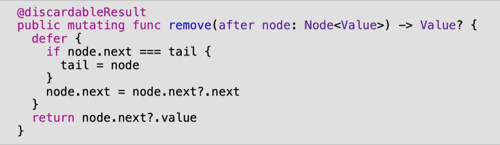

节点的解除链接发生在defer块中。如果被移除的节点是尾部节点，需要特别注意，因为尾部的引用必须被更新。

回到playground上试试吧。你知道该怎么做。

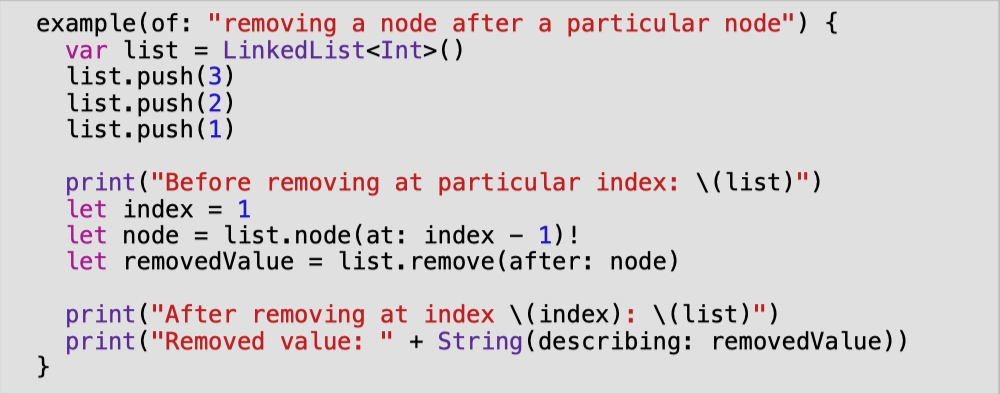

你应该在控制台看到以下输出。

    ---Example of removing a node after a particular node--
    Before removing at particular index: 1 -> 2 -> 3 
    After removing at index 1: 1 -> 3 
    Removed value: Optional(2)

试着添加更多的元素，并玩弄一下索引的值。与insert(at:)类似，这个操作的时间复杂度是O(1)，但它要求你事先有一个特定节点的引用。

# 性能分析

你又遇到了一个检查点! 回顾一下，你已经实现了从链表中移除数值的三个操作。

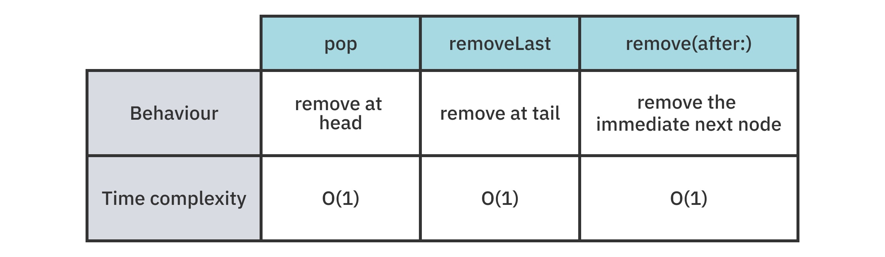

在这一点上，你已经定义了一个世界上大多数程序员都能理解的链接列表的接口。然而，还有一些工作要做，以装饰 Swift 的语义。在本章的下半部分，你将专注于使这个接口尽可能的Swifty。

# Swift集合协议

Swift标准库有一组协议，帮助定义对某一特定类型的期望。这些协议中的每一个都对特性和性能提供了某些保证。从这套协议中，你将专注于四个与集合相关的协议。

下面是对每个协议作用的快速总结。

- 第1层，序列。一个序列类型提供对其元素的顺序访问。它有一个重要的注意事项：使用顺序访问可能会破坏性地消耗元素，这样你就不能重新访问它们了。

- 第2层，集合。一个集合类型是一个提供额外保证的序列类型。一个集合类型是有限的，允许重复的非破坏性的顺序访问。

- 第3层，双向收集（BidirectionalColllection）。一个集合类型可以是一个双向的集合类型，如果它，如其名称所示，可以允许在序列上和序列下的双向旅行。这对于链表来说是不可能的，因为你只能从头走到尾，而不能反过来走。

- 第4层，随机访问集合。如果一个双向集合类型能够保证访问一个特定索引的元素和访问任何其他索引的元素所花的时间一样长，那么它就可以成为一个随机访问的集合类型。这对于链接列表来说是不可能的，因为访问列表前面的节点要比访问列表后面的节点快得多。

对于每一种方法都有更多的说法。当你为它们写符合性时，你会了解更多关于它们的信息。

链表可以从 Swift 集合协议中获得两个资格。首先，由于链接列表是一个节点链，采用 Sequence 协议是有意义的。其次，由于节点链是一个有限序列，采用 Collection 协议是有意义的。

# 成为一个 Swift 集合

在本节中，你将研究实现集合协议。一个集合类型是一个有限序列，并提供非破坏性的顺序访问。一个 Swift 集合还允许通过下标进行访问，下标是一个花哨的术语，表示一个索引可以映射到集合中的一个值。

下面是一个使用Swift数组的下标的例子。

    array[5]

数组的索引是一个Int值--本例中的值为5。下标操作是用方括号定义的。使用带有索引的下标将从集合中返回一个值。

# 自定义集合索引

集合协议方法性能的一个决定性指标是将一个索引映射到一个值的速度。与其他存储选项（如 Swift Array）不同，链表无法使用整数索引实现 O(1) 下标操作。因此，你的目标是定义一个自定义索引，其中包含对各自节点的引用。

在 LinkedList.swift 中，添加以下扩展。

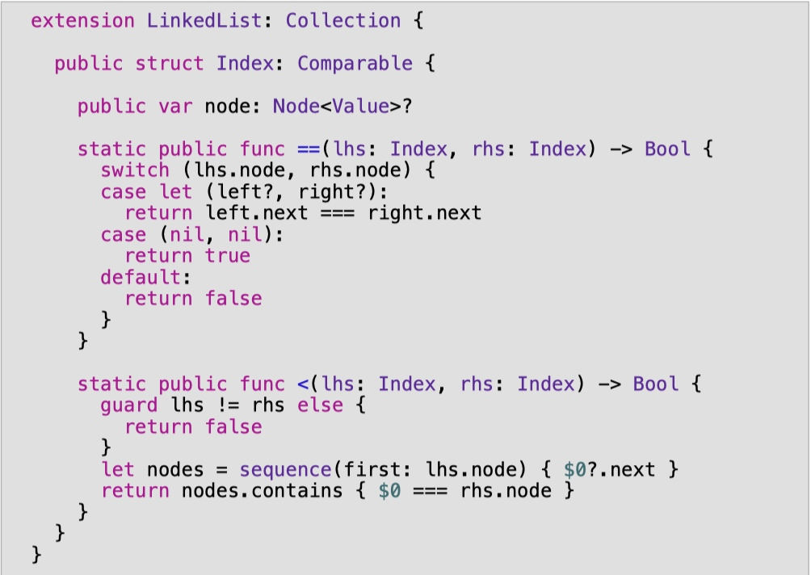

你将使用这个自定义索引来完成收集要求。在扩展中写下以下内容来完成它。

```swift
// 1 
public var startIndex: Index {

  Index(node: head) 
} 

// 2 
public var endIndex: Index {
  Index(node: tail?.next) 
} 

// 3
public func index(after i: Index) -> Index { 
  Index(node: i.node?.next) 
} 

// 4 
public subscript(position: Index) -> Value {
  position.node!.value 
}
```

1. startIndex是由链表的头部合理定义的。

2. Collection将endIndex定义为最后一个可访问值之后的索引，所以你给它tail?.next。

3.index(after:)决定了索引如何被增加。你只需给它一个紧随其后的节点的索引。

4. 下标用于将一个索引映射到集合中的值。由于你已经创建了自定义的索引，你可以通过引用节点的值在恒定时间内轻松实现。

这就结束了采用集合的程序。导航回playground页面并进行试运行。

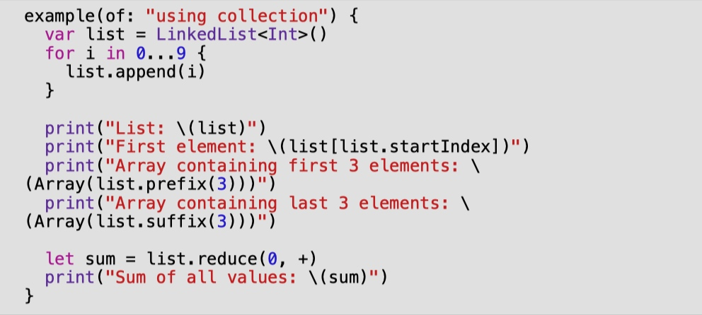

你应该看到以下输出。

    ---Example of using collection--
    List: 0 -> 1 -> 2 -> 3 -> 4 -> 5 -> 6 -> 7 -> 8 -> 9 
    First element: 0 
    Array containing first 3 elements: [0, 1, 2] 
    Array containing last 3 elements: [7, 8, 9] 
    Sum of all values: 45
    
# 值语义和写时复制

Swift集合的另一个重要品质是它有价值语义。这可以通过写时复制（copy-on-write）有效地实现，在此称为COW。为了说明价值语义的概念，你将使用数组来探索这一行为。

在playground页面的底部写下以下内容。


你应该看到以下输出。

    ---Example of array cow--
    array1: [1, 2] 
    array2: [1, 2]
    ---After adding 3 to array 2--
    array1: [1, 2] 
    array2: [1, 2, 3]
    
当array2被修改时，array1的元素是不变的。在引擎盖下面，当append被调用时，array2对底层存储做了一个拷贝。

现在，检查你的链表是否有价值语义。在playground页面的底部写下以下内容。

```swift
example(of: "linked list cow") {
  var list1 = LinkedList<Int>()
  list1.append(1) 
  list1.append(2) 
  var list2 = list1 
  print("List1: \(list1)") 
  print("List2: \(list2)")

  print("After appending 3 to list2") 
  list2.append(3) 
  print("List1: \(list1)") 
  print("List2: \(list2)")
}
```

你应该看到以下输出。

    ---Example of linked list cow--
    List1: 1 -> 2 
    List2: 1 -> 2 
    After appending 3 to list2 
    List1: 1 -> 2 -> 3 
    List2: 1 -> 2 -> 3
    
不幸的是，你的链接列表没有值的语义！这是因为你的底层存储使用了引用类型（Node）。这是因为你的底层存储使用了一个引用类型（Node）。这是一个严重的问题，因为LinkedList是一个结构，应该使用值语义。实现COW可以解决这个问题。

用COW实现值语义的策略是相当直接的。在突变链接列表的内容之前，你要对底层存储进行拷贝，并将所有引用（头部和尾部）更新到新的拷贝上。

在LinkedList.swift中，为LinkedList添加以下方法。

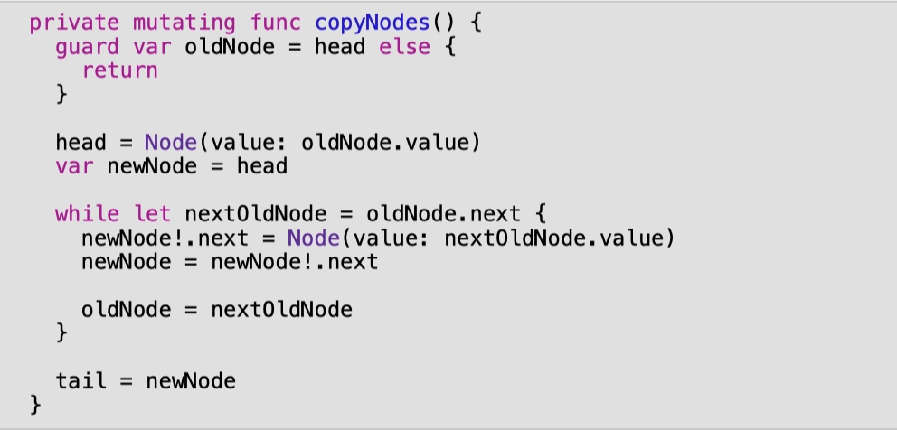

这个方法将用新分配的相同值的节点替换你的链接列表的现有节点。

现在在LinkedList中找到所有标有mutating关键字的其他方法，并在每个方法的顶部调用copyNodes。

总共有六个方法。

- 推进

- 附加

- insert(after:)

- pop

- 删除最后一个

- remove(after:)

在你完成改造后，最后一个例子的函数调用应该产生以下输出。

    ---Example of linked list cow--
    List1: 1 -> 2 
    List2: 1 -> 2 
    After appending 3 to list2 
    List1: 1 -> 2 
    List2: 1 -> 2 -> 3
    
这就是你想要的! 好吧，除了在每个变异调用上引入一个O(n)的开销之外...

# 优化COW

每次变异调用的O(n)开销是不可接受的。有两个策略有助于缓解这个问题。第一个是在节点只有一个所有者时避免复制。

# isKnownUniquelyReferenced

在Swift标准库中，有一个名为isKnownUniquelyReferenced的函数。这个函数可以用来确定一个对象是否正好有一个引用。在链接列表COW的例子中测试一下。

在最后一个例子的函数调用中，找到写有var list2 = list1的那一行，将其更新为以下内容。

```swift
print("List1 uniquely referenced: \
  (isKnownUniquelyReferenced(&list1.head))") 
var list2 = list1 
print("List1 uniquely referenced: \ 
  (isKnownUniquelyReferenced(&list1.head))")
```

你应该在控制台中看到两行新字。

    List1 uniquely referenced: true 
    List1 uniquely referenced: false

使用isKnownUniquelyReferenced，你可以检查底层节点对象是否是共享的! 既然你已经验证了这一行为，那就删除这两条打印语句。你的路径就清楚了。在 copyNodes 的顶部添加以下条件。

```swift
guard !isKnownUniquelyReferenced(&head) else { 
  return 
}
```
你可以高兴地看到COW仍然非常有效。

    ---Example of linked list cow--
    List1: 1 -> 2 
    List2: 1 -> 2 
    After appending 3 to list2 
    List1: 1 -> 2 
    List2: 1 -> 2 -> 3
    
有了这个变化，你的链接列表的性能将恢复到以前的性能，并获得COW的好处。

# 一个小的困境

在你之前的示例代码中添加以下代码。

```swift
print("Removing middle node on list2") 
if let node = list2.node(at: 0) { 
  list2.remove(after: node) 
} 
print("List2: \(list2)")
```

你应该看到以下控制台输出。

    ---Example of linked list cow--
    List1: 1 -> 2 
    List2: 1 -> 2 
    After appending 3 to list2 
    List1: 1 -> 2 
    List2: 1 -> 2 -> 3 
    Removing middle node on list2 
    List2: 1 -> 2 -> 3
    
移除操作不再起作用了。其原因在于我们所做的CoW优化。因为每次突变都会触发节点的拷贝，remove(after:)的实现是对错误的节点集进行移除。为了纠正这个问题，你要写一个专门版本的copyNodes方法。回到Sources目录下的LinkedList.swift中，在copyNodes方法的下面写上以下内容。

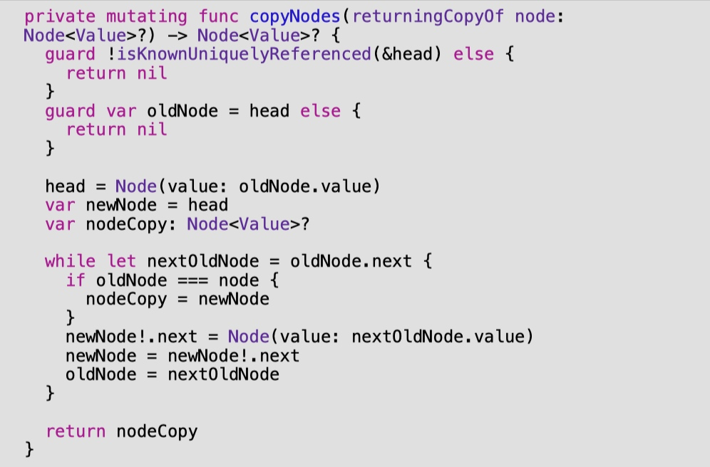

这个方法与之前的实现有很多相似之处。主要区别在于，它将根据传入的参数返回新复制的节点。将remove(after:)方法更新为以下内容。


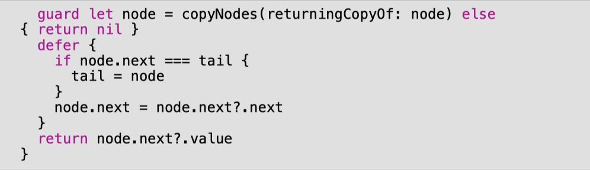

你现在使用你刚刚创建的方法，对新复制的节点进行删除。

# 共享节点

第二个优化是部分共享节点。事实证明，在某些情况下，你可以避免复制。对所有情况的全面评估超出了本书的范围，但这将使你对其中的内容有一个概念。

看一下下面的例子（不需要写下来）。

```swift
var list1 = LinkedList<Int>()
(1...3).forEach { 
  list1.append($0) 
} 
var list2 = list1
```


现在考虑在禁用奶牛的情况下对 list2 进行推送操作的后果。

    list2.push(0)
    
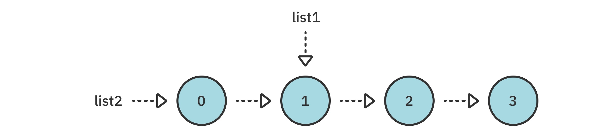
list1是否受到对list2的推送操作的影响？在这种情况下不会! 如果你要打印这两个列表，你会得到以下输出。

    List1: 1 -> 2 -> 3 
    List2: 0 -> 1 -> 2 -> 3
    
在这种情况下，向 list1 推送 100 的结果也是安全的。

    list1.push(100)

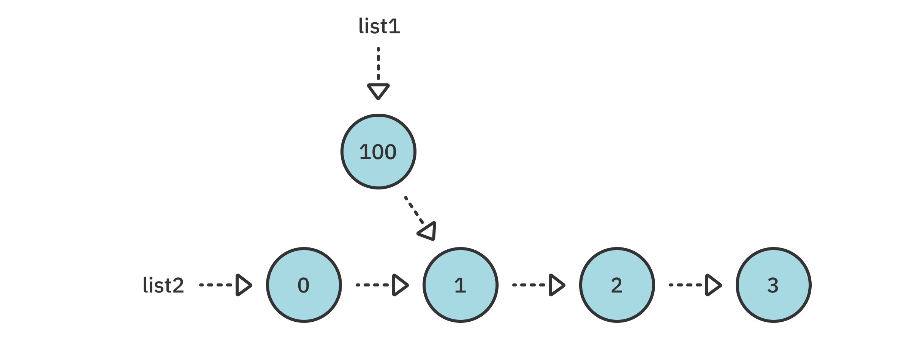

如果你现在要打印这两个列表，你会得到以下输出。

    List1: 100 -> 1 -> 2 -> 3 
    List2: 0 -> 1 -> 2 -> 3
    
链表的单向性意味着先入为主的插入可以忽略 "COW税"!

# 关键点

- 链接列表是线性和单向的。一旦你把一个引用从一个节点移到另一个节点，你就不能再回去了。

- 关联列表的时间复杂度是O(1)，即从头插入。数组的时间复杂度为O(n)，即从头开始插入。

- 符合Swift的集合协议，比如序列和集合，可以自动让你获得许多有用的方法。

- 写时复制行为让你在实现价值语义的同时保持良好的性能。


------
|[上一章](/Blogs/DataStructuresChapter5.html)|[目录](/Blogs/DataStructuresChapter0.html)|[下一章](/Blogs/DataStructuresChapter7.html)|
|:----:|:------:|:-------:|